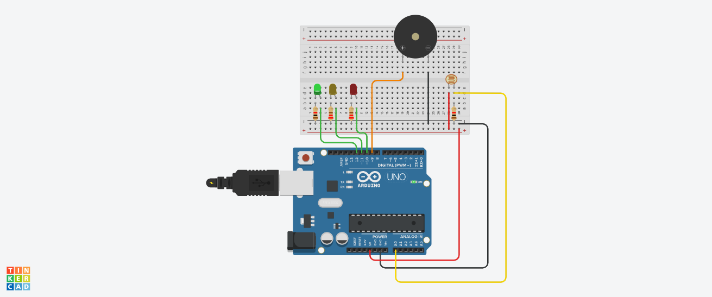

# 🍷 Projeto Arduino: Monitoramento de Luminosidade para Vinheria Agnello

Este repositório apresenta o projeto desenvolvido com base em um problema enfrentado pela **Vinheria Agnello**, que busca garantir a melhor qualidade de seus vinhos por meio do controle ambiental, especialmente da **luminosidade** no local de armazenamento.

---

## 👥 Integrantes

| Nome                  | RM         |
|-----------------------|------------|
| Leonardo Yukio        | RM562864   |
| Vinicius Gama Q. Silva| RM561617   |
| Victor Pereira        | RM561548   |
| Paulo                 | RM565898   |

---

## 🧠 Caso / Problema

A **Vinheria Agnello** identificou que a **qualidade dos vinhos** armazenados é influenciada diretamente pelas condições do ambiente, principalmente **temperatura, umidade e luminosidade**.

Neste projeto inicial, o foco é **monitorar a luminosidade** do ambiente, pois a exposição inadequada à luz pode comprometer a conservação dos vinhos.

### Desafios propostos:

- Desenvolver um sistema com **Arduino** para **capturar os dados de luminosidade** utilizando um **sensor LDR**.
- A partir desses dados, implementar um sistema de alarme com **LEDs**:
  - ✅ LED Verde: ambiente com luminosidade ideal.
  - ⚠️ LED Amarelo: luminosidade em nível de alerta.
  - ❌ LED Vermelho: luminosidade em nível crítico.
- Quando estiver em **nível de alerta**, deve soar um **buzzer por 3 segundos**, e repetir caso a condição permaneça.

---

## 💡 Lógica do Código

A lógica do programa implementado é baseada em três faixas de luminosidade detectadas pelo sensor LDR:

1. **Ambiente ideal**: ativa o **LED Verde** para indicar que a luminosidade está dentro do aceitável.
2. **Nível de alerta**: ativa o **LED Amarelo** e **aciona um buzzer** por 3 segundos, alertando sobre a necessidade de intervenção.
3. **Nível crítico**: ativa o **LED Vermelho**, indicando que a luminosidade ultrapassou os limites aceitáveis.

O Arduino realiza essas leituras e atualizações **em tempo real**, garantindo uma resposta imediata às variações de luz no ambiente.

---

## 🛠️ Estrutura do Arduino

### Componentes utilizados:

- 1x Arduino UNO
- 1x Sensor LDR (fotoresistor)
- 3x LEDs (Verde, Amarelo, Vermelho)
- 1x Buzzer
- Resistores
- Jumpers e Protoboard

### Esquema de montagem:

